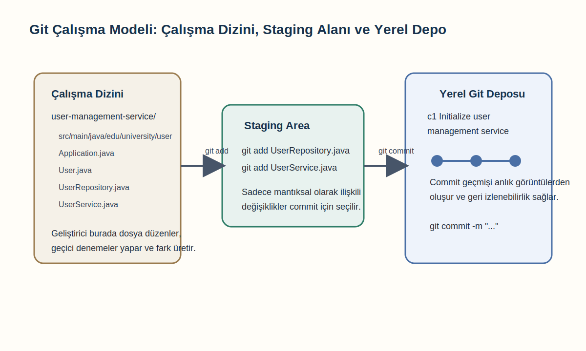
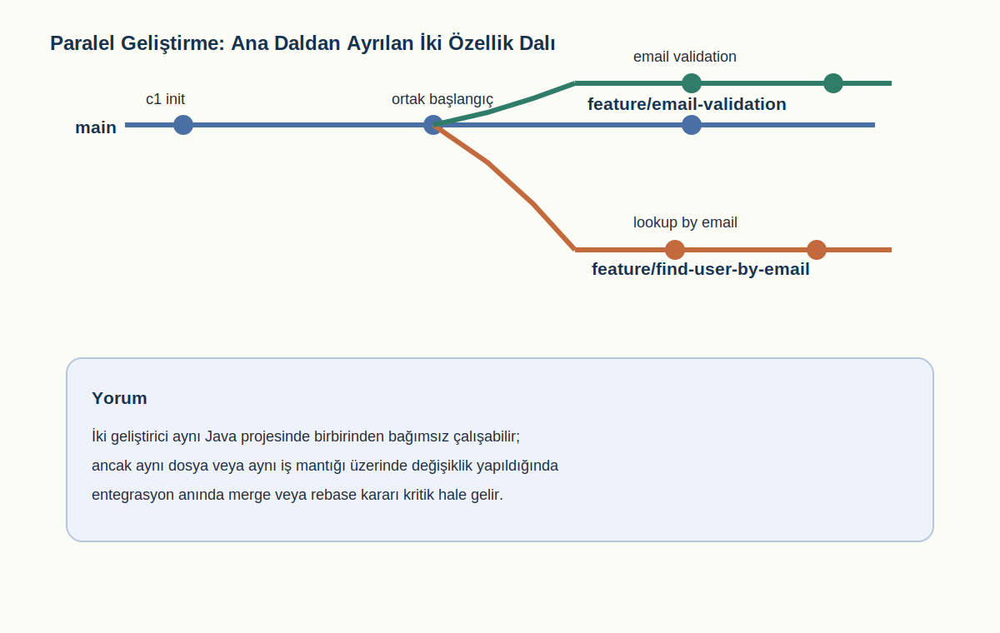
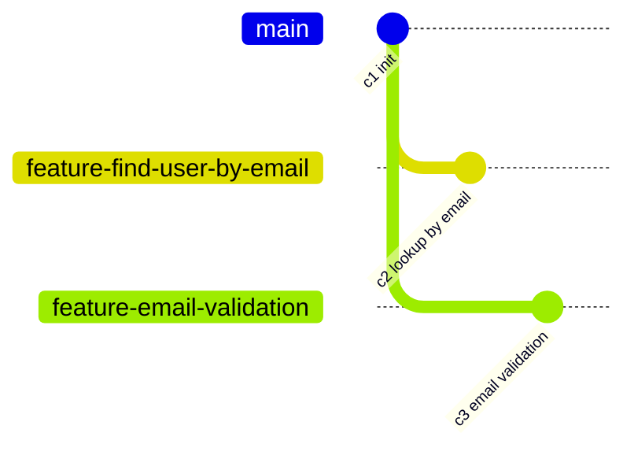
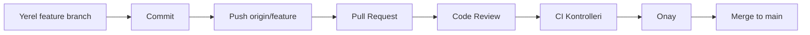
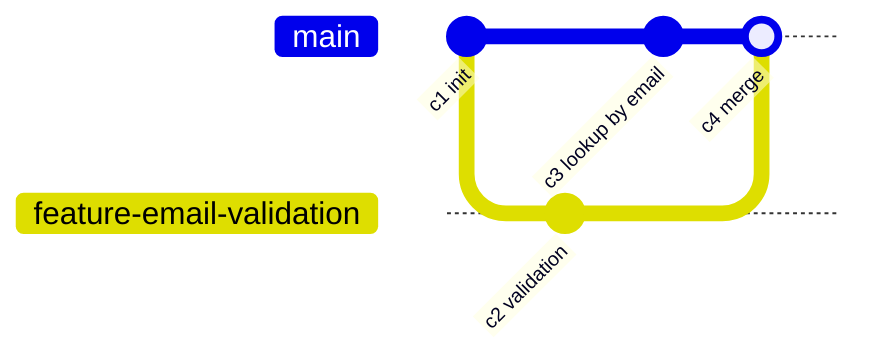
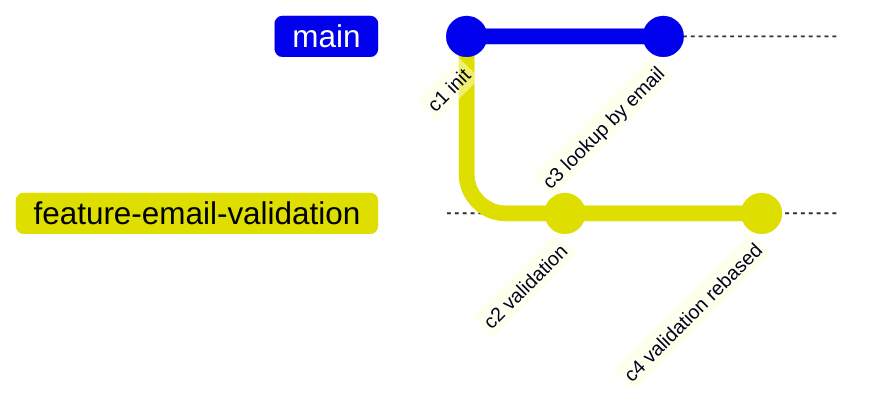
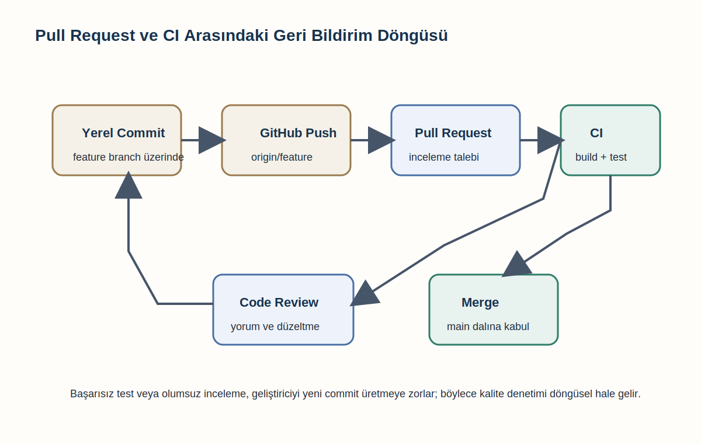

# Bölüm 2: Git ve GitHub

## Giriş

DevOps mühendisliği, yazılım geliştirme ile işletim süreçleri arasındaki sınırları azaltmayı, değişikliklerin daha hızlı, daha izlenebilir ve daha güvenilir biçimde üretim ortamına taşınmasını hedefleyen bir disiplindir. Bu hedefe ulaşmak için sürüm kontrolü yalnızca yardımcı bir araç değil, tüm yaşam döngüsünü düzenleyen temel bir altyapıdır. Kaynak kodunun hangi anda kim tarafından, hangi gerekçeyle ve hangi kapsamda değiştirildiğinin kayıt altına alınması; ekip çalışmasının düzenlenmesi, hataların geriye doğru izlenmesi, otomasyon boru hatlarının tetiklenmesi ve kalite denetimlerinin sürdürülebilir biçimde yürütülmesi açısından zorunludur. Bu bölümde Git ve GitHub, tek bir Java projesi üzerinden, başlangıç kodundan ekip içi iş birliğine ve sürekli entegrasyona kadar uzanan kesintisiz bir akış içinde incelenecektir.

## Örnek Proje ve Başlangıç Kodu

İncelenecek örnek proje bir kullanıcı yönetim servisidir. Bu servis, bir kurumun temel kullanıcı kayıtlarını tutmak, yeni kullanıcı eklemek, kullanıcı listelemek ve e-posta adresine göre arama yapmak için tasarlanmıştır. Proje özellikle küçük tutulmuştur; amaç üretim ölçeğinde bir uygulama kurmak değil, sürüm kontrolünün yazılım yaşam döngüsündeki davranışını somut bir örnek üzerinde görünür kılmaktır. Ancak küçük olmasına rağmen proje, Git ile ilgili temel ve ileri kavramların tamamını tartışmaya yetecek kadar gerçektir. Süreç, bir geliştiricinin yerel çalışma dizininde kodu oluşturmasıyla başlayacak; ardından depo başlatılacak, ilk commit alınacak, ikinci bir geliştirici devreye girecek, paralel geliştirme nedeniyle dal ayrışmaları ve çakışmalar oluşacak, daha sonra merge ve rebase stratejileri karşılaştırılacak, GitHub üzerinde pull request ve code review akışı kurulacak, son olarak da bu yapının CI ile ilişkisi değerlendirilecektir.



Şekil 2.1. Kullanıcı yönetim servisi bağlamında çalışma dizini, staging alanı ve commit geçmişi arasındaki ilişki.

Projenin başlangıç hali basit bir Maven tabanlı Java uygulamasıdır. Aşağıdaki yapı, henüz sürüm kontrolüne alınmamış, geliştiricinin yerel makinesinde duran ilk çalışma durumunu göstermektedir:

```text
user-management-service/
├── pom.xml
└── src/
    └── main/
        └── java/
            └── edu/
                └── university/
                    └── user/
                        ├── Application.java
                        ├── User.java
                        ├── UserRepository.java
                        └── UserService.java
```

İlk kod tabanı, temel işlevleri gösterecek kadar yeterlidir. Uygulamanın giriş noktası, servis nesnesini oluşturup örnek kullanıcılarla çalıştıran küçük bir sınıftır:

```java
package edu.university.user;

public class Application {
    public static void main(String[] args) {
        UserRepository repository = new UserRepository();
        UserService service = new UserService(repository);

        service.register("u100", "Ayse Demir", "ayse@university.edu");
        service.register("u101", "Mehmet Kaya", "mehmet@university.edu");

        System.out.println(service.findAll());
    }
}
```

Alan modelini temsil eden `User` sınıfı aşağıdaki gibidir:

```java
package edu.university.user;

public class User {
    private final String id;
    private final String fullName;
    private final String email;

    public User(String id, String fullName, String email) {
        this.id = id;
        this.fullName = fullName;
        this.email = email;
    }

    public String getId() {
        return id;
    }

    public String getFullName() {
        return fullName;
    }

    public String getEmail() {
        return email;
    }

    @Override
    public String toString() {
        return "User{id='%s', fullName='%s', email='%s'}"
                .formatted(id, fullName, email);
    }
}
```

Veri erişimi için kalıcı bir veritabanı yerine bellek içi bir liste kullanılmaktadır. Eğitim amacıyla bu yaklaşım yeterlidir; çünkü burada asıl amaç iş kurallarından çok değişiklik yönetimidir:

```java
package edu.university.user;

import java.util.ArrayList;
import java.util.List;

public class UserRepository {
    private final List<User> users = new ArrayList<>();

    public void save(User user) {
        users.add(user);
    }

    public List<User> findAll() {
        return new ArrayList<>(users);
    }
}
```

Servis katmanı ise kayıt ekleme ve tüm kullanıcıları listeleme işlemlerini sunar:

```java
package edu.university.user;

import java.util.List;

public class UserService {
    private final UserRepository repository;

    public UserService(UserRepository repository) {
        this.repository = repository;
    }

    public void register(String id, String fullName, String email) {
        User user = new User(id, fullName, email);
        repository.save(user);
    }

    public List<User> findAll() {
        return repository.findAll();
    }
}
```

## Git Deposu Oluşturma ve İlk Commit

Bu aşamada proje henüz sürüm kontrolü altında değildir. Geliştirici tek başına çalışıyor gibi görünse de gerçekte en kritik risk burada başlar. Kod yalnızca dosya sistemi üzerinde durmaktadır; değişiklik geçmişi yoktur, önceki sürümlere dönülemez, hangi düzenlemenin neden yapıldığı kayıt altında değildir ve ekip içinde paylaşılabilir bir iş akışı henüz kurulmamıştır. Bu nedenle ilk teknik adım, çalışma dizinini bir Git deposuna dönüştürmektir.

Git deposu başlatmak için proje kök dizininde aşağıdaki komut çalıştırılır:

```bash
git init
```

Bu komutla birlikte dizin içinde gizli `.git` klasörü oluşturulur. Söz konusu klasör, çalışma ağacının normal dosyalarından ayrıdır ve sürüm geçmişi, nesne veritabanı, dallar, referanslar ve yapılandırma bilgileri burada saklanır. Başka bir ifadeyle Git, yalnızca dosyaları izleyen bir araç değildir; dosyaların zaman içindeki durumlarını ve bu durumlar arasındaki ilişkileri nesne tabanlı bir yapı içinde kaydeder. `git init` komutu ile birlikte bu yapı hazırlanmış olur, fakat henüz hiçbir dosya izlenmemektedir.

Burada kavramsal olarak önemli olan nokta, Git'in merkezinde dosya farklarının değil anlık görüntülerin bulunmasıdır. Her commit, proje ağacının belirli bir andaki durumunu temsil eder. Bu yaklaşım, özellikle DevOps bağlamında güvenilir geri dönüş senaryoları için değerlidir; çünkü sistem yalnızca "hangi satır değişti" sorusuna değil, "o anda depo bütünüyle nasıldı" sorusuna da yanıt verir. Bir kullanıcı yönetim servisinde ileride güvenlik doğrulaması, rol yönetimi veya denetim kayıtları eklendiğinde, bu işlevlerin hangi birleşik durumdan geldiğini anlamak için commit anlık görüntüsü mantığı belirleyici olacaktır.

Git deposu başlatıldığı anda oluşturulan nesneler doğrudan görünmez; geliştirici çoğu zaman yalnızca çalışma ağacıyla temas eder. Ancak arka planda her commit için ağaç nesneleri, blob nesneleri ve ebeveyn ilişkileri oluşur. Bu iç yapı, dallanma ve birleştirme işlemlerinin neden bu kadar hızlı olduğunu açıklar. Dal açmak, pratikte yeni bir klasör kopyalamak anlamına gelmez; çoğu zaman yalnızca bir referansın yeni bir commit zincirini izlemesi anlamına gelir. Bu nedenle Git'te dal sayısının fazla olması tek başına sorun değildir; asıl sorun, dalların semantik olarak yönetilememesidir.

Depo başlatıldıktan sonra ilk yapılması gereken iş, hangi dosyaların sürüm kontrolüne dahil edileceğini netleştirmektir. Java projelerinde derleme çıktıları, IDE klasörleri ve geçici dosyalar genellikle depoya alınmaz. Bu nedenle, daha ilk adımdan itibaren `.gitignore` dosyasının oluşturulması gerekir:

```gitignore
target/
.idea/
*.iml
.classpath
.project
.settings/
```

Bu dosya küçük görünse de ekip disiplini bakımından önemlidir. Bir projede hangi dosyaların kaynak kodu, hangilerinin yerel geliştirme artığı olduğu baştan tanımlanmazsa depo çok kısa sürede gürültülü ve sürdürülemez hale gelir. Sürüm kontrolünde düzen, ilk committen önce kurulur; sonradan eklenen kurallar genellikle gereksiz geçmiş kirliliği yaratır.

İlk commit öncesi çalışma ağacındaki durum `git status` ile gözlemlenir. Git bu aşamada tüm dosyaları izlenmeyen içerik olarak listeler. Ancak Git'in doğrudan commit aldığı düşünülmemelidir. Commit işlemi iki aşamalıdır: önce değişiklikler staging area olarak bilinen indeks alanına alınır, sonra bu anlık görüntü commit nesnesi olarak kaydedilir. Dolayısıyla ilk commit için önce gerekli dosyalar stage edilir:

```bash
git add pom.xml
git add .gitignore
git add src/main/java/edu/university/user/Application.java
git add src/main/java/edu/university/user/User.java
git add src/main/java/edu/university/user/UserRepository.java
git add src/main/java/edu/university/user/UserService.java
```

Uygulamada bu komutlar çoğu zaman `git add .` şeklinde tek satırda verilir. Ancak öğretim bağlamında dosyaları tek tek eklemek staging kavramını görünür kılar. Staging area, commit içeriğini bilinçli olarak düzenlemeye yarayan tampon bölgedir. Bu yapı sayesinde çalışma dizininde çok sayıda değişiklik bulunsa bile geliştirici bunların yalnızca anlamlı bir alt kümesini commit edebilir. Özellikle büyük ekiplerde ve uzun süreli geliştirmelerde bu ayrım, commit kalitesinin korunması açısından belirleyicidir.

Staging alanının eğitimde sıklıkla eksik anlaşılan yönü, bunun yalnızca geçici bekleme noktası olmadığıdır. İndeks, aynı zamanda bir sonraki commit için ilan edilen içeriktir. Bu nedenle geliştirici `git diff` ile çalışma dizini farklarını, `git diff --staged` ile ise commit'e girmesi planlanan farkları ayrı ayrı inceleyebilir. Bu ayrım, özellikle kullanıcı yönetim servisi gibi eğitim amaçlı küçük projelerde bile önemlidir; çünkü gerçek hayatta aynı gün içinde işlevsel değişiklik, hata ayıklama çıktısı, yapılandırma düzeltmesi ve deneysel kod aynı çalışma ağacında birikebilir. Bunların hepsini tek commit altında birleştirmek, sonraki haftalarda geçmişi anlamsız hale getirir.

İlk commit aşağıdaki mesajla kaydedilebilir:

```bash
git commit -m "Initialize user management service"
```

İlk commit, projenin sürüm geçmişindeki temel referans noktasıdır. İyi bir ilk commit, çalışır durumda bir iskelet sunmalı ve depoyu alan başka bir geliştiricinin projeyi başlatabilmesini sağlamalıdır. Bozuk derlenen, eksik dosya içeren veya kararsız bir ilk commit, daha ilk günden teknik borç üretir. Bu nedenle commit yalnızca değişiklik kaydı değil, aynı zamanda ekip içi sözleşmedir.

Commit mesajı da bu sözleşmenin parçasıdır. İyi bir mesaj, geçmişe bakıldığında bağlamı hızla hatırlatır. "Initialize user management service" ifadesi bu nedenle yalnızca bir başlangıç etiketi değildir; projenin hangi sınırlarla açıldığını da ima eder. Eğer ilk commit içine hem proje iskeleti hem test çerçevesi hem Docker yapılandırması hem de ilk üç işlev sıkıştırılsaydı, başlangıç noktası öğretici olmaktan çıkardı. Akademik ve profesyonel bağlamda iyi commit yazımı, yazılımın evrimini okunabilir hale getiren temel becerilerden biridir.

## Uzak Depo ve İkinci Geliştiricinin Katılımı

İlk committen sonra proje üzerinde ikinci bir ihtiyacın ortaya çıktığını varsayalım: kullanıcıların e-posta adresine göre sorgulanabilmesi. İlk geliştirici bu özelliği eklemeyi planlarken, aynı anda ikinci bir geliştirici de sisteme katılır. Böylece tek kişilik doğrusal çalışma modeli sona erer ve DevOps açısından asıl önemli alan olan eşzamanlı değişiklik yönetimi başlar.

İkinci geliştiricinin katılmasıyla birlikte proje uzak depoya taşınır. Örneğin GitHub üzerinde `user-management-service` adlı boş bir depo açıldığını düşünelim. İlk geliştirici, yerel depoyu bu uzak depoya bağlar:

```bash
git remote add origin https://github.com/example/user-management-service.git
git branch -M main
git push -u origin main
```

Bu andan itibaren `main` dalı ekip için ortak referans haline gelir. Burada temel ilke, `main` dalının daima anlamlı ve mümkün olduğunca çalışır durumda tutulmasıdır. DevOps pratiklerinde bu ilke kritik önemdedir; çünkü CI iş akışları, dağıtım tetikleri ve geri alma stratejileri çoğu zaman ana dalın güvenilirliğine dayanır.

Uzak depo ile yerel depo arasındaki ilişki yalnızca kopyalama ilişkisi değildir. `origin/main` gibi uzak izleme dalları, yerel geliştiricinin paylaşılan gerçekliği hangi noktada gördüğünü gösterir. İkinci geliştirici projeyi klonladığında aslında yalnızca dosyaları değil, geçmişi ve ortak referans modelini de edinmiş olur. Böylece ekip içinde "şu anki doğru durum nedir" sorusu kişisel klasörlerin içeriğine değil, paylaşılan commit geçmişine göre yanıtlanır. DevOps bağlamında doğruluğun kişilere değil, izlenebilir geçmişe dayanması kritik bir yönetişim ilkesidir.

İkinci geliştirici depoyu klonlar:

```bash
git clone https://github.com/example/user-management-service.git
cd user-management-service
```

## Paralel Değişiklik Problemi ve Branch Oluşturma

Bu noktada iki geliştirici aynı geçmişten başlamaktadır. Ancak aynı kod tabanı üzerinde, birbirinden habersiz biçimde değişiklik yaptıklarında paralel değişiklik problemi ortaya çıkar. İlk geliştirici `UserService` sınıfına e-posta ile arama özelliği eklemek isterken, ikinci geliştirici aynı sınıfta kayıt işlemi sırasında e-posta doğrulaması eklemektedir. Her iki değişiklik de mantıklıdır; sorun, aynı dosya ve hatta aynı metodlar çevresinde gerçekleşmeleridir.



Şekil 2.2. İki geliştiricinin aynı Java projesi üzerinde bağımsız dallar açarak paralel ilerleme biçimi.

İlk geliştirici doğrudan `main` dalında ilerlemek yerine yeni bir dal oluşturmalıdır. Dal mekanizması, Git'in en güçlü soyutlamalarından biridir. Bir dal, belirli bir commit nesnesine işaret eden hareketli bir referanstır. Teknik olarak ucuz, iş akışı bakımından ise son derece değerlidir. Özellik, hata düzeltme, deneme veya refaktör çalışmaları izole dallarda yürütüldüğünde ana dalın bütünlüğü korunur. Bu nedenle ilk geliştirici aşağıdaki dalı açar:

```bash
git checkout -b feature/find-user-by-email
```

İkinci geliştirici de benzer şekilde kendi dalını oluşturur:

```bash
git checkout -b feature/email-validation
```

Bu yapı, iki kişinin aynı proje üzerinde birbirini beklemeden çalışabilmesini sağlar. Buradaki kritik nokta, dal oluşturmanın yalnızca teknik bir işlem değil, ekip içi sorumluluk ayrımı olmasıdır. Her dal belirli bir amaca karşılık gelmelidir. Rastgele, belirsiz veya çok kapsamlı dallar zamanla yönetilemez hale gelir. Dal adlarının amaca işaret etmesi, değişiklik incelemesini kolaylaştırır.

Dal stratejisi belirlenirken en önemli sorulardan biri, bir dalın yaşam süresinin ne kadar olacağıdır. Kısa ömürlü özellik dalları genellikle daha az çatışma üretir ve inceleme sürecini hızlandırır. Buna karşılık haftalarca açık kalan dallar, ana daldan giderek uzaklaşır; bu da entegrasyon maliyetini artırır. Kullanıcı yönetim servisi örneğinde dallar küçük ve nettir: biri e-posta ile arama, diğeri e-posta doğrulama içindir. Bu sınırlılık sayesinde hem commit kapsamı hem de inceleme kapsamı kontrol altında kalmaktadır. DevOps yaklaşımında küçük değişikliklerin sık entegrasyonu, büyük değişikliklerin seyrek entegrasyonundan genellikle daha güvenilirdir.

İlk geliştirici, e-posta ile kullanıcı arama özelliği üzerinde çalışırken önce `UserRepository` sınıfını genişletir:

```java
package edu.university.user;

import java.util.ArrayList;
import java.util.List;

public class UserRepository {
    private final List<User> users = new ArrayList<>();

    public void save(User user) {
        users.add(user);
    }

    public List<User> findAll() {
        return new ArrayList<>(users);
    }

    public User findByEmail(String email) {
        for (User user : users) {
            if (user.getEmail().equalsIgnoreCase(email)) {
                return user;
            }
        }
        return null;
    }
}
```

Ardından servis katmanına bu yeteneği ekler:

```java
package edu.university.user;

import java.util.List;

public class UserService {
    private final UserRepository repository;

    public UserService(UserRepository repository) {
        this.repository = repository;
    }

    public void register(String id, String fullName, String email) {
        User user = new User(id, fullName, email);
        repository.save(user);
    }

    public List<User> findAll() {
        return repository.findAll();
    }

    public User findByEmail(String email) {
        return repository.findByEmail(email);
    }
}
```

## Staging Kullanımı ve Commit Disiplini

Bu noktada staging kavramının pratik değeri belirginleşir. Diyelim ki geliştirici `UserRepository` ve `UserService` değişikliklerini tamamlamış, fakat `Application.java` üzerinde test amaçlı geçici `println` ifadeleri de eklemiştir. Bu durumda tüm çalışma ağacını tek seferde commit etmek yerine yalnızca özellik için gerekli dosyalar stage edilmelidir:

```bash
git add src/main/java/edu/university/user/UserRepository.java
git add src/main/java/edu/university/user/UserService.java
git status
```

Staging alanı bu örnekte iki amaçla kullanılır. Birincisi, commit kapsamını daraltır. İkincisi, çalışma dizinindeki deneysel veya geçici değişikliklerin istemeden kalıcı geçmişe girmesini engeller. Geliştirici daha sonra `Application.java` üzerindeki geçici değişiklikleri temizleyebilir ya da başka bir committe değerlendirebilir. Bu ayrım, commit disiplininin merkezindedir.

Geliştirici isterse satır veya hunk düzeyinde seçim de yapabilir. Örneğin `git add -p` kullanılarak dosya içindeki yalnızca belirli parçalar stage edilebilir. Bu özellik, özellikle aynı dosyada hem hata düzeltme hem refaktör hem de deneysel düzenleme yapıldığında büyük önem taşır. Eğitim bağlamında küçük görünen bu ayrıntı, gerçek projelerde inceleme kalitesini doğrudan etkiler. Çünkü inceleyici açısından önemli olan, değişikliğin mantıksal bütünlüğüdür; fiziksel olarak aynı dosyada bulunması değildir.

Commit disiplini, Git kullanımında çoğu zaman araç komutlarından daha önemlidir. İyi bir commit aşağıdaki özellikleri taşır: tek bir mantıksal amacı vardır; derlenebilir veya en azından tutarlı bir ara durum sunar; mesajı neden yapıldığını ya da ne değiştiğini açıkça belirtir; ilgisiz düzenlemeleri aynı kayıt içinde toplamaz. Kötü commitler ise çok sayıda farklı amacı tek bir değişiklik setinde birleştirir, incelemeyi zorlaştırır ve geri alma maliyetini yükseltir. Bu nedenle ilk geliştirici, yalnızca e-posta ile arama özelliğini içeren bir commit üretir:

```bash
git commit -m "Add user lookup by email"
```

İkinci geliştirici ise kendi dalında `register` metodunu değiştirmektedir. Amaç, boş e-posta ile kullanıcı oluşturulmasını engellemektir:

```java
package edu.university.user;

import java.util.List;

public class UserService {
    private final UserRepository repository;

    public UserService(UserRepository repository) {
        this.repository = repository;
    }

    public void register(String id, String fullName, String email) {
        if (email == null || email.isBlank()) {
            throw new IllegalArgumentException("Email cannot be empty");
        }

        User user = new User(id, fullName, email);
        repository.save(user);
    }

    public List<User> findAll() {
        return repository.findAll();
    }
}
```

İkinci geliştirici de bu değişikliği stage edip uygun bir commit mesajıyla kaydeder:

```bash
git add src/main/java/edu/university/user/UserService.java
git commit -m "Validate email before user registration"
```

## Commit Graph ve Gelişen Geçmiş

Bu andan itibaren commit graph oluşmaya başlamıştır. Git geçmişi artık tek çizgili değildir; aynı başlangıç noktasından türemiş iki ayrı dal vardır. Commit graph, Git'in soyut olarak anlattığı geçmişi görselleştirmeye yarar ve özellikle dallanma davranışını anlamak için büyük değer taşır. Aşağıdaki diyagram, ilk committen sonra iki özellik dalının nasıl ayrıştığını göstermektedir.

Bu diyagram, `main` dalındaki ilk kararlı durumdan iki bağımsız geliştirme dalının türediğini ve her bir dalın kendi commit geçmişini ürettiğini göstermek için verilmiştir.



Diyagram incelendiğinde, iki geliştiricinin aynı temel noktadan hareket ederek birbirinden bağımsız iki farklı değişiklik ürettiği görülür. Bu yapı, iş paralelliğini mümkün kılar; ancak aynı dosyalar üzerinde çalışılıyorsa gelecekte birleştirme maliyeti de doğurur. Commit graph bu nedenle yalnızca geçmişin resmi değil, yaklaşan entegrasyon risklerinin de haritasıdır.

Bu grafiği okurken her commitin yalnızca metin değişikliği olmadığını hatırlamak gerekir. `c2` commitinde kullanıcıyı e-posta ile bulma davranışı sisteme eklenmiştir; `c3` commitinde ise veri doğrulama kuralı güçlendirilmiştir. Yani graph üzerindeki her nokta, kod tabanının işlevsel anlamda farklı bir durumuna karşılık gelir. DevOps araç zinciri, bu işlevsel durumları esas alır. Örneğin bir CI çalıştırması belirli bir commit üzerinde yapılır; bir güvenlik taraması belirli bir commit SHA'sına rapor verir; bir üretim sürümü belirli bir committen türetilir. Bu nedenle commit graph, operasyonel gerçekliğin de kaydıdır.

## GitHub Push ve Pull Request Süreci

İlk geliştirici çalışmasını tamamladığında dalını GitHub'a gönderir:

```bash
git push -u origin feature/find-user-by-email
```

GitHub üzerinde bu dal için bir pull request açılır. Pull request, yalnızca kod birleştirme talebi değildir; tartışma, inceleme, kalite kontrol ve otomasyonun buluştuğu iş birliği birimidir. Pull request içinde başlık, açıklama, commitler, satır bazlı farklar, inceleyici yorumları, durum denetimleri ve bağlamsal tartışmalar yer alır. Böylece değişiklik teknik olarak bir dala eklenmeden önce, kurumsal belleğin parçası haline gelir.

Pull request sürecini daha sistematik anlamak için akışın görsel ifadesi yararlıdır. Aşağıdaki diyagram, bir geliştiricinin yerel dalda yaptığı değişiklikten GitHub üzerindeki inceleme ve birleştirme aşamasına kadar olan süreci göstermektedir.

Bu diyagram, GitHub tabanlı ekip çalışmasında değişikliğin hangi aşamalardan geçerek ana dala ulaştığını özetlemek amacıyla eklenmiştir.



Bu akışta dikkat edilmesi gereken nokta, `push` işlemi ile entegrasyonun tamamlanmamasıdır. Asıl kurumsal entegrasyon, pull request üzerinden yürütülen inceleme ve doğrulama süreci sonunda gerçekleşir. DevOps yaklaşımında kodun paylaşılması ile kodun kabul edilmesi aynı şey değildir; aradaki kalite kapıları bilinçli olarak korunur.

Pull request açılırken yalnızca teknik farkların değil, değişikliğin etkisinin de açıklanması gerekir. Örneğin kullanıcı yönetim servisinde e-posta ile arama özelliği eklenirken şu sorular önemlidir: arama büyük-küçük harf duyarlı mı olacaktır; eşleşme bulunamazsa sistem ne döndürecektir; sonraki aşamada veritabanına geçildiğinde aynı davranış korunacak mıdır; bu değişiklik gelecekte REST uç noktası eklendiğinde nasıl yansıyacaktır? İyi bir pull request açıklaması, bu tür tasarım kararlarını kısa ama açık biçimde kaydeder. Böylece code review yalnızca "bu satır doğru mu" seviyesinde kalmaz, daha üst düzey teknik tercihleri de değerlendirebilir.

GitHub üzerinde çoğu ekip, pull requestleri bazı kurallarla korur. En yaygın uygulamalar arasında en az bir inceleyici onayı, başarılı CI koşulu, doğrudan `main`e push yasağı ve çözülmemiş yorum varken merge engeli bulunur. Bu kurallar aracı zorlaştırmak için değil, değişiklik kabulünü standartlaştırmak için kullanılır. Bir üniversite dersinde bu noktanın özellikle vurgulanması gerekir; çünkü öğrenciler GitHub'ı çoğu zaman yalnızca uzaktaki bir klasör gibi algılar. Oysa modern yazılım ekiplerinde GitHub, yönetişim mekanizmasının bir parçasıdır.

İlk pull request açıldığında ikinci geliştiricinin çalışması henüz `main` dalına alınmamıştır. İnceleyici, değişikliği değerlendirirken örneğin `findByEmail` metodunun `null` dönmesi yerine `Optional<User>` kullanılmasını önerebilir, fakat eğitim amacıyla mevcut haliyle kabul edildiğini varsayalım. Pull request birleştirildiğinde `main` dalında yeni bir merge ya da fast-forward durumu oluşabilir. GitHub ayarlarına bağlı olarak burada farklı stratejiler mümkündür. Basit anlatım için, ilk dalın çatışma üretmeden `main` dalına merge edildiğini düşünelim.

## Merge, Conflict ve Merge Commit

Birleştirme tamamlandıktan sonra ikinci geliştiricinin dalı geride kalmıştır. Çünkü kendi dalı, `main`in son durumunu içermemektedir. Bu durum, ekip çalışmasında çok yaygındır. Sorun henüz görünür değildir; ancak ikinci geliştirici dalını güncel `main` ile birleştirmeye çalıştığında aynı dosyada yapılan değişiklikler çakışabilir. Nitekim burada hem e-posta doğrulama özelliği hem de e-posta ile arama özelliği `UserService.java` üzerinde değişiklik yapmıştır.

Birleştirme davranışını açıklamak için önce merge yaklaşımını ele almak gerekir. Merge, iki farklı commit geçmişini ortak bir üst commit altında birleştirir. Git, mümkün olduğunda metinsel farklılıkları otomatik çözer; fakat aynı satırlar veya yakın bağlam aynı anda değiştirildiyse çakışma ortaya çıkar. Aşağıdaki diyagram, `main` dalının ilerlediği bir ortamda özellik dalının merge ile nasıl entegre edildiğini göstermektedir.

Bu diyagram, iki dalın geçmişini koruyarak yeni bir merge commit üretildiği tipik entegrasyon biçimini açıklamak için verilmiştir.



Merge yaklaşımında dal yapısı geçmiş içinde görünür kalır. Bu durum özellikle ekipte hangi değişikliğin hangi bağlamda entegre edildiğini izlemek açısından yararlıdır. Buna karşılık çok yoğun dallanma olan projelerde commit graph zamanla karmaşıklaşabilir. Yine de merge'in en büyük avantajı, tarihsel akışı yeniden yazmamasıdır. Özellikle paylaşılan dallarda bu özellik önemlidir.

Merge işlemi sırasında Git'in ortak ata commit bulduğunu ve üç yönlü bir karşılaştırma yaptığını hatırlamak yararlıdır. Sistem, ortak atadan birinci dala ve ortak atadan ikinci dala giden değişiklikleri karşılaştırarak yeni içeriği hesaplar. Eğer iki dal birbirinden uzak dosyalarda değişiklik yaptıysa sonuç otomatik üretilir. Eğer aynı bağlam üzerinde değişiklik yapıldıysa geliştiricinin karar vermesi gerekir. Bu yaklaşım, çakışmanın yalnızca "aynı dosya" nedeniyle değil, aynı mantıksal bölge üzerinde yarışan değişiklikler nedeniyle çıktığını da gösterir.

İkinci geliştirici, kendi dalını güncel `main` ile birleştirmek için aşağıdaki komutları kullanır:

```bash
git checkout feature/email-validation
git fetch origin
git merge origin/main
```

Git bu noktada `UserService.java` dosyasında çakışma bildirir. Çatışma metinsel olarak aşağıdaki gibi görünebilir:

```java
public class UserService {
    private final UserRepository repository;

    public UserService(UserRepository repository) {
        this.repository = repository;
    }

    public void register(String id, String fullName, String email) {
<<<<<<< HEAD
        if (email == null || email.isBlank()) {
            throw new IllegalArgumentException("Email cannot be empty");
        }
=======
>>>>>>> origin/main
        User user = new User(id, fullName, email);
        repository.save(user);
    }

    public List<User> findAll() {
        return repository.findAll();
    }

<<<<<<< HEAD
=======
    public User findByEmail(String email) {
        return repository.findByEmail(email);
    }
>>>>>>> origin/main
}
```

Çakışma işaretleri Git'in dosyaya bilinçli olarak yerleştirdiği geçici göstergelerdir. `<<<<<<< HEAD` ile `=======` arasındaki bölüm mevcut dalın, `=======` ile `>>>>>>> origin/main` arasındaki bölüm ise birleştirilmeye çalışılan dalın içeriğini gösterir. Bu aşamada yapılması gereken iş, iki taraftan doğru parçaları koruyarak dosyayı anlamlı bir son duruma getirmektir. Başarılı bir conflict çözümü, yalnızca işaretleri silmek değildir; kodun davranışını doğru kurmaktır.

Çatışma çözümünde sık yapılan hata, daha yeni görünen tarafı seçerek diğer tarafı tümüyle silmektir. Oysa iyi çözüm, iki değişikliğin niyetini anlamayı gerektirir. Bu örnekte bir tarafta veri kalitesi kuralı, diğer tarafta sorgulama yeteneği vardır. Bunlar birbirini dışlayan değişiklikler değildir; dolayısıyla çözüm iki davranışı da korumalıdır. Eğer geliştirici yalnızca `origin/main` tarafını kabul etseydi e-posta doğrulaması kaybolurdu; yalnızca `HEAD` tarafını kabul etseydi arama işlevi kaybolurdu. Çatışma çözümünün pedagojik değeri tam da burada ortaya çıkar: entegrasyon, satır seçmekten çok niyetleri birleştirmektir.

Bu örnekte doğru çözüm, hem e-posta doğrulamasını hem de e-posta ile aramayı aynı sınıfta birlikte barındırmaktır:

```java
package edu.university.user;

import java.util.List;

public class UserService {
    private final UserRepository repository;

    public UserService(UserRepository repository) {
        this.repository = repository;
    }

    public void register(String id, String fullName, String email) {
        if (email == null || email.isBlank()) {
            throw new IllegalArgumentException("Email cannot be empty");
        }

        User user = new User(id, fullName, email);
        repository.save(user);
    }

    public List<User> findAll() {
        return repository.findAll();
    }

    public User findByEmail(String email) {
        return repository.findByEmail(email);
    }
}
```

Çatışma çözüldükten sonra dosya yeniden stage edilir ve merge işlemi tamamlanır:

```bash
git add src/main/java/edu/university/user/UserService.java
git commit
```

Bu commit, normal bir özellik commitinden farklı olarak merge commit niteliği taşır. Git genellikle varsayılan bir mesaj önerir; örneğin `Merge remote-tracking branch 'origin/main' into feature/email-validation` gibi bir ifade kullanılabilir. Merge commitin önemi, iki farklı geçmiş çizgisini ortak ebeveyn ilişkisiyle bağlamasında yatar. Bu nedenle commit graph üzerinde dalların yeniden birleştiği açık biçimde görülebilir.

Merge commit ayrıca denetim izi bakımından da yararlıdır. Daha sonra ekip geçmişe baktığında, e-posta doğrulama özelliğinin ana dalın hangi durumuyla birleştiğini ve entegrasyonun nerede gerçekleştiğini açık biçimde görebilir. Özellikle üretim hatası sonrası kök neden analizi yapılırken bu görünürlük önem kazanır. Bir sorun, özelliğin kendisinden değil, özelliğin başka bir değişiklikle birleşme biçiminden kaynaklanabilir. Merge commit bu tür analizlerde işlevsel bir işaret görevi görür.

Çatışma çözümünden sonra geliştirici testlerini çalıştırmalı ve davranışın beklenen biçimde korunduğunu doğrulamalıdır. Sürüm kontrolü ile davranış doğrulaması birbirinden ayrı düşünülemez. Özellikle conflict çözümünden sonra kod derlense bile anlamsal bozulma olabilir. Örneğin geliştirici yanlışlıkla doğrulama koşulunu silmiş, metod sıralarını bozmuş veya repository çağrısını değiştirmiş olabilir. Bu sebeple merge işlemi ile test çalıştırma adımı operasyonel olarak birlikte ele alınmalıdır.

İkinci geliştirici dalını GitHub'a gönderdiğinde, artık kendi dalı güncel `main` ile uyumlu olduğu için pull request açabilir:

```bash
git push -u origin feature/email-validation
```

Pull request incelemesi sırasında code review yapılır. Code review, sadece söz dizimi denetimi değildir. İyi bir inceleme aşağıdaki türde sorular üretir: değişiklik gerçekten gerekli midir; kapsamı ihtiyacın ötesine geçiyor mu; hata durumları düşünülmüş müdür; isimlendirme açık mıdır; testler eklenmiş midir; gelecekteki bakım maliyeti düşürülmüş müdür; aynı hedef daha küçük bir değişiklikle sağlanabilir miydi? Örneğin bu proje için bir inceleyici, `IllegalArgumentException` mesajının daha açıklayıcı olması gerektiğini, `findByEmail` için birim testi eklenmesini ya da `UserRepository` dönüş tipinin daha güvenli hale getirilmesini önerebilir.

Etkili code review için inceleyicinin değişikliği bütünsel bağlam içinde değerlendirmesi gerekir. Kullanıcı yönetim servisinde e-posta doğrulama eklendiğinde, yalnızca `if` koşulunun doğru yazılıp yazılmadığına bakmak yeterli değildir. İnceleyici ayrıca şu soruları da sormalıdır: bu doğrulama yalnızca servis katmanında mı kalmalıdır, yoksa daha sonra API katmanında da yinelenmeli midir; hata mesajı son kullanıcıya mı, geliştiriciye mi yöneliktir; boşluk karakterlerinden oluşan girişler neden özel olarak ele alınmıştır; gelecekte birden fazla kullanıcı türü eklendiğinde bu doğrulama ortak bir politika haline getirilebilir mi? Bu düzeyde inceleme, kodu yalnızca bugünden değil, evrimi içinden görmeyi gerektirir.

Akademik bağlamda code review öğretiminin önemli bir boyutu da yorum yazma kalitesidir. İyi bir inceleme yorumu emredici değil gerekçelendiricidir. Örneğin "Bunu değiştir" ifadesi yerine "Burada `null` yerine `Optional` kullanılması, çağıran kodda hata durumunu daha görünür kılabilir" ifadesi daha öğreticidir. Bu yaklaşım ekip içinde savunmacı iletişimi azaltır ve teknik tartışmanın düzeyini yükseltir. Pull request araçları bu nedenle yalnızca kusur bulma mekanizması değil, yazılım tasarımını ortaklaştırma ortamı olarak değerlendirilmelidir.

Code review süreci, kurumsal kaliteyi yalnızca sonuca bakarak değil, kararların gerekçesini tartışarak yükseltir. Bu nedenle pull request açıklamasına neyin neden yapıldığını yazmak önemlidir. Örnek bir açıklama aşağıdaki biçimde olabilir:

```text
Özet:
- Kullanıcı kayıt işleminde boş e-posta kontrolü eklendi.

Gerekçe:
- Sistemde eksik kullanıcı verisi oluşmasını engellemek.

Etkiler:
- register metodu boş veya null email geldiğinde istisna fırlatır.
```

Bu açıklama kısa görünse de, değişikliğin niyetini kayıt altına alır. Aylar sonra commit mesajı tek başına yeterli olmazsa pull request tartışması önemli bağlam sunar. GitHub bu açıdan yalnızca kod barındırma platformu değil, yazılım kararlarının arşividir.

Bazı ekipler pull request açıklamalarını şablonlarla standartlaştırır. Örneğin "özet", "neden", "test kanıtı", "risk", "geri alma planı" başlıkları zorunlu tutulabilir. Bu yaklaşım ilk bakışta bürokratik görünebilir; ancak özellikle üretim sistemlerine giden değişikliklerde karar kalitesini yükseltir. Kullanıcı yönetim servisi eğitim amacıyla küçük olsa da aynı ilke burada da geçerlidir. Eğer geliştirici e-posta doğrulama kuralını eklerken test eklemediğini açıkça belirtirse, inceleyici bu eksikliği bilinçli olarak tartışabilir. Böylece kalite sorunları örtük kalmaz.

## Rebase Yaklaşımı

Buraya kadar merge tabanlı bir entegrasyon izlendi. Ancak Git dünyasında sıklıkla tartışılan ikinci yaklaşım rebase'tir. Rebase, bir dalın commitlerini başka bir temel commit üzerine yeniden oynatarak daha doğrusal bir geçmiş üretir. Aynı örnek üzerinden düşünülürse, ikinci geliştirici `main` dalında e-posta arama özelliği birleştirildikten sonra kendi dalını merge etmek yerine rebase edebilirdi:

```bash
git checkout feature/email-validation
git fetch origin
git rebase origin/main
```

Rebase sırasında da çakışma çıkabilir. Fark şudur: merge iki geçmişi bir araya getirirken, rebase bir dalın commitlerini yeni temel üzerine taşır. Çakışma oluşursa geliştirici dosyayı düzenler, stage eder ve şu komutla devam eder:

```bash
git add src/main/java/edu/university/user/UserService.java
git rebase --continue
```

Rebase davranışını anlamak için görsel ifade yararlıdır. Aşağıdaki diyagram, özellik dalındaki commitin yeni temel olarak `main`in son commitini alacak şekilde yeniden konumlandırıldığını göstermektedir.

Bu diyagram, rebase işlemi sonunda geçmişin doğrusal hale gelişini ve özgün commitin yeni bir kimlikle yeniden yazıldığını açıklamak amacıyla kullanılmıştır.



Bu şemada son commit görsel olarak tek çizgiye oturur; çünkü rebase işleminden sonra özellik dalının commiti artık `c1` üzerine değil, `c3` üzerine kuruludur. Teknik açıdan önemli ayrıntı şudur: `c4`, içerik benzer olsa da `c2` ile aynı commit değildir. Yeni ebeveyn ilişkisi nedeniyle yeni bir commit kimliği oluşmuştur. Bu nedenle rebase, geçmişi yeniden yazar.

Rebase'in pedagojik açıdan önemli sonucu, geliştiriciyi commit serisinin iç tutarlılığıyla yüzleştirmesidir. Eğer bir özellik dalında art arda alınmış commitler birbirine bağımlı fakat düzensizse, rebase sırasında bu düzensizlik daha görünür hale gelir. Geliştirici burada `rebase -i` gibi araçlarla commitleri birleştirebilir, sıralarını düzeltebilir veya mesajlarını iyileştirebilir. Bu işlem özellikle henüz paylaşılmamış yerel geçmiş için yararlıdır. Böylece pull requeste taşınan commit serisi, ilk deneme izlerini değil, öğretici ve incelemeye elverişli bir mantıksal akışı yansıtır.

## Merge ve Rebase Karşılaştırması

Merge ile rebase arasındaki karşılaştırma, araç tercihinden çok ekip politikası meselesidir. Merge'in avantajı, tarihsel gerçekliği korumasıdır. Hangi dalın ne zaman ayrıldığını ve nasıl birleştiğini açık biçimde gösterir. Özellikle paylaşılan dallarda güvenlidir; çünkü mevcut commit kimliklerini değiştirmez. Rebase'in avantajı ise daha doğrusal, okunması daha kolay bir geçmiş sunmasıdır. Özellik dalı ana dala alınmadan önce yerel veya henüz paylaşılmamış commitler üzerinde kullanıldığında oldukça etkilidir. Buna karşılık başkalarının da kullandığı paylaşılan commitler üzerinde rebase yapmak risklidir; çünkü commit kimliklerinin değişmesi ekip arkadaşlarının geçmişle senkronunu bozar. Klasik kural şu şekilde özetlenebilir: yayımlanmış geçmiş üzerinde yeniden yazım yapma, kendi yerel çalışma alanında ise rebase'i temiz bir geçmiş üretmek için bilinçli biçimde kullan.

Bu bağlamda merge ve rebase karşılaştırması yalnızca görsel düzen meselesi değildir. Denetim izi, eğitim amaçlı şeffaflık, hata ayıklama stratejisi, otomasyon geçmişi ve ekip büyüklüğü bu kararı etkiler. Örneğin büyük bir kurumda her pull request için merge commit tutulması, değişiklik paketlerini denetim açısından izlemeyi kolaylaştırabilir. Buna karşılık hızlı hareket eden küçük bir ekip, `main` geçmişini doğrusal tutmak için squash ve rebase kombinasyonunu tercih edebilir. Önemli olan, seçilen politikanın tutarlı ve belgelenmiş olmasıdır.

Üniversite düzeyinde bir DevOps dersinde merge ile rebase'in birlikte öğretilmesi önemlidir; çünkü öğrencinin yalnızca komut bilmesi yeterli değildir, hangi bağlamda hangisini seçmesi gerektiğini kavraması gerekir. Öğrenci, ortak kullanılan bir dal üzerinde rebase yapmanın ekip arkadaşlarının geçmişini neden bozacağını; buna karşılık kendi yerel dalını güncel `main` üzerine taşımanın neden daha okunabilir bir pull request üretebileceğini anlayabilmelidir. Kavramsal olgunluk tam olarak burada ortaya çıkar.

## Code Review ve Anti-Patternler

GitHub üzerinde ana dala katkı üretirken pull request ve code review süreçlerinin yanında bazı anti-pattern davranışlardan da kaçınmak gerekir. Birinci anti-pattern, doğrudan `main` dalına commit göndermektir. Bu yaklaşım, inceleme ve CI kapılarını aşındırır. İkinci anti-pattern, çok büyük pull requestler oluşturmaktır. Yüzlerce satırdan oluşan, birden fazla amacı aynı anda taşıyan değişiklikler etkili biçimde incelenemez. Üçüncü anti-pattern, anlamsız commit mesajlarıdır. `fix`, `update`, `changes` gibi mesajlar zaman içinde neredeyse hiçbir bilgi taşımaz. Dördüncü anti-pattern, biçimsel düzenlemeleri işlevsel değişikliklerle aynı committe toplamaktır. Böyle bir durumda inceleyici gerçek davranış değişimini ayırt etmekte zorlanır. Beşinci anti-pattern ise çatışma çözümlerini test etmeden birleştirmektir. Bu davranış özellikle üretim sistemlerinde ciddi regresyonlara yol açabilir.

Bu anti-patternleri örnek proje üzerinde somutlaştırmak mümkündür. Örneğin geliştirici aynı commit içinde hem `UserService` iş mantığını değiştirmiş hem de tüm dosyalarda girinti düzeltmesi yapmışsa, satır bazlı farklar gereksiz şekilde şişer. Ya da `findByEmail` özelliği, açıklama yapılmadan doğrudan `main` dalına push edilmişse, ekip arkadaşları değişikliğin neden yapıldığını ve hangi bağlamda doğrulandığını sonradan anlamakta zorlanır. DevOps kültürü, yalnızca otomasyon değil, değişikliklerin gözden geçirilebilir ve geri izlenebilir biçimde yapılmasını da içerir.

Bir başka anti-pattern, uzun süre yerel makinede tutulup paylaşılmayan commit serileridir. Geliştirici günler boyunca kendi dalında çalışıp hiç push yapmazsa, hem geri bildirim döngüsü uzar hem de ana dal ile ayrışma artar. Bu durum çatışma olasılığını yükseltir ve entegrasyon stresini bir anda büyük hale getirir. Küçük ama sık paylaşılan değişiklikler, özellikle ekip içinde görünürlük ve erken uyarı mekanizması sağlar. DevOps pratiği bu nedenle yalnızca otomatik teslimi değil, erken paylaşımı da teşvik eder.

Diğer bir anti-pattern, commit geçmişini sonradan açıklamaya çalışmaktır. Eğer commit mesajları zayıf, pull request açıklamaları eksik ve inceleme yorumları yüzeyselse, ekip üyeleri haftalar sonra geçmişi okuyarak gerçek niyeti yeniden inşa etmeye çalışır. Bu durum hem zaman kaybı yaratır hem de hatalı yorumlara neden olabilir. Sürüm kontrolünün değeri, değişiklik anındaki bağlamın mümkün olduğunca o anda kaydedilmesinden gelir. Geçmişin sonradan sözlü açıklamalarla tamamlanması güvenilir değildir.

## CI Entegrasyonu ve Otomatik Doğrulama

Sürüm kontrolü ile sürekli entegrasyon arasındaki ilişki bu noktada belirginleşir. GitHub üzerinde bir pull request açıldığında CI sistemi otomatik olarak devreye girebilir. Örneğin GitHub Actions kullanılarak, her push ve pull request olayında Maven derlemesi ve test çalıştırması yapılabilir. Bu yapı, sürüm kontrolü olaylarını kalite kapılarıyla bağlar. Aşağıdaki örnek iş akışı, Java projemiz için temel bir CI tanımı sunmaktadır:



Şekil 2.3. Pull request incelemesi ile otomatik testlerin birbirini tamamladığı kalite geri bildirim döngüsü.

```yaml
name: Java CI

on:
  push:
    branches: [main]
  pull_request:
    branches: [main]

jobs:
  build-and-test:
    runs-on: ubuntu-latest

    steps:
      - name: Checkout source
        uses: actions/checkout@v4

      - name: Set up JDK
        uses: actions/setup-java@v4
        with:
          distribution: temurin
          java-version: 17

      - name: Build with Maven
        run: mvn -B clean test
```

Bu örnekte CI sistemi iki durumda tetiklenir: `main` dalına yapılan push işlemlerinde ve `main`e açılan pull requestlerde. Böylece henüz merge gerçekleşmeden önce değişiklik doğrulanır. Bu yaklaşım özellikle az önce tartışılan conflict çözüm senaryolarında kritik önemdedir. Çünkü metinsel birleşme başarılı olsa bile davranışsal bozulma ancak testlerle yakalanabilir.

CI ile GitHub arasındaki ilişki, DevOps kültüründe "değişiklik odaklı kalite güvencesi" olarak düşünülebilir. Burada denetim zamanlanmış periyotlarda değil, olay tetiklemeli biçimde gerçekleşir. Başka bir ifadeyle sistem, değişiklik olduğu için çalışır. Bu model, sürüm kontrolü ile otomasyon arasında sıkı bir bağ kurar. Kullanıcı yönetim servisinde e-posta doğrulama kuralı eklendiğinde, testlerin her push sonrası otomatik çalışması sayesinde eksik veya hatalı bir entegrasyonun `main` dalına ilerlemesi zorlaştırılır.

CI boru hattı yalnızca derleme ve birim testten ibaret olmak zorunda değildir. Aynı iş akışına statik analiz, bağımlılık güvenlik taraması, kod biçim denetimi ve kapsama raporu da eklenebilir. Ancak öğretimsel yalınlık için burada en temel kalite kapısı olan derleme ve test adımı üzerinde durulmuştur. Temel ilke şudur: bir commit veya pull request, insan incelemesinden önce ya da onunla eşzamanlı olarak makine tarafından doğrulanmalıdır. İnsan ve otomasyon denetimleri birbirinin alternatifi değil tamamlayıcısıdır.

Örnek projeyi CI ile daha anlamlı kılmak için basit birim testleri de düşünelim. `UserService` için aşağıdaki JUnit testi yazılabilir:

```java
package edu.university.user;

import org.junit.jupiter.api.Test;

import static org.junit.jupiter.api.Assertions.assertEquals;
import static org.junit.jupiter.api.Assertions.assertThrows;

class UserServiceTest {

    @Test
    void shouldRegisterUserAndFindByEmail() {
        UserRepository repository = new UserRepository();
        UserService service = new UserService(repository);

        service.register("u200", "Zeynep Arslan", "zeynep@university.edu");

        User user = service.findByEmail("zeynep@university.edu");
        assertEquals("u200", user.getId());
    }

    @Test
    void shouldRejectBlankEmail() {
        UserRepository repository = new UserRepository();
        UserService service = new UserService(repository);

        assertThrows(IllegalArgumentException.class,
                () -> service.register("u201", "Kerem Yildiz", " "));
    }
}
```

Bu testler iki farklı dalda geliştirilen işlevlerin birlikte yaşadığını doğrular. Aynı zamanda sürüm kontrolü geçmişindeki her önemli entegrasyon adımının otomatik doğrulama ile desteklenmesi gerektiğini de gösterir. DevOps yaklaşımında Git olayları ile CI olayları arasında doğrudan bir nedensellik ilişkisi bulunur: değişiklik yapılır, sürüm kontrolüne kaydedilir, paylaşılır, doğrulanır ve kabul edilirse ana hatta dahil edilir.

Bu ilişki öğretimde özellikle vurgulanmalıdır; çünkü öğrenciler çoğu zaman Git'i geliştiricinin bireysel aracı, CI'ı ise ayrı bir sunucu görevi gibi düşünür. Oysa modern pratikte bunlar tek zincirin halkalarıdır. Örneğin bir pull requestte test başarısız olduğunda code review süreci de etkilenir; çünkü inceleyici çalışmayan bir değişikliği davranışsal düzeyde değerlendiremez. Benzer biçimde testler geçtiğinde bile code review gereksiz hale gelmez; çünkü doğruluk ile uygun tasarım aynı şey değildir. Bu denge, DevOps'un insan-merkezli ve otomasyon-destekli doğasını açıkça gösterir.

Bu akışı baştan sona bir zaman çizgisi olarak düşünmek öğreticidir. İlk olarak geliştirici yerel makinede kullanıcı yönetim servisini başlatmıştır. Daha sonra `git init` ile depo kurulmuş, `.gitignore` tanımlanmış ve ilk commit alınmıştır. Uzak depo GitHub üzerinde açılmış, `main` dalı yayımlanmıştır. İkinci geliştirici projeye katılmış ve depo klonlanmıştır. İki geliştirici farklı özellikler için ayrı dallarda çalışmıştır. Staging area kullanılarak commit kapsamları dikkatle seçilmiş, mantıksal olarak ayrık commitler üretilmiştir. Bu sırada commit graph dallanmıştır. İlk özellik pull request ile ana dala alınmış, ikinci özellik ise `main` ilerlediği için entegrasyon sırasında conflict üretmiştir. Çatışma çözülmüş, merge commit oluşturulmuş ve code review sonrasında değişiklik kabul edilmiştir. Alternatif olarak aynı senaryonun rebase ile nasıl yönetilebileceği gösterilmiş, iki yaklaşımın avantaj ve riskleri karşılaştırılmıştır. Son aşamada GitHub olaylarının CI ile bağlanması sayesinde sürüm kontrolü yalnızca tarihsel bir kayıt olmaktan çıkıp kalite güvencesinin etkin tetikleyicisi haline gelmiştir.

Bu zaman çizgisini daha da dikkatli okunduğunda, her adımın sonraki adım için zemin hazırladığı görülür. Başlangıç kodu düzenli olmadığı takdirde ilk commit sağlıklı olmaz. İlk commit düzenli değilse dallanma noktası belirsizleşir. Dallar amaç odaklı kurulmadığında staging ve commit disiplini anlamını kaybeder. Commitler iyi ayrıştırılmadığında pull request okunamaz hale gelir. Pull request zayıf olduğunda code review yüzeysel kalır. İnceleme ve CI yeterince güçlü değilse merge ya da rebase sonrasında hatalı değişiklikler ana dala sızar. Dolayısıyla Git ve GitHub pratikleri bağımsız komut kümeleri değil, zincirleme bir mühendislik sistemidir.

Kullanıcı yönetim servisi örneğinde bu zincirin her halkası gözle görülebilir durumdadır. `UserRepository` içinde e-posta arama davranışı eklenmiş, `UserService` içinde veri doğrulaması tanımlanmış, aynı sınıf üzerindeki eşzamanlı değişiklikler çatışma üretmiş, çatışma çözümü sonrası iki davranış birlikte korunmuştur. Eğer bu süreç sürüm kontrolü disiplini olmadan yürütülseydi, ekip üyeleri muhtemelen dosyaları birbirine göndererek veya son çalışan sürümü manuel olarak birleştirerek ilerlemek zorunda kalacaktı. Bu tür yöntemler kısa vadede pratik görünse de izlenebilirlik, doğrulanabilirlik ve otomasyona bağlanabilirlik sunmaz.

DevOps mühendisliği açısından asıl değer, Git geçmişinin operasyonel süreçlerle birleşebilmesidir. Örneğin ileride bu kullanıcı yönetim servisinin konteyner imajı üretildiğinde, imaj etiketi belirli bir commit SHA'sına bağlanabilir. Benzer şekilde üretimde çıkan bir hata, belirli bir merge commit sonrasında görülmeye başladıysa kök neden analizi geçmiş üzerinden yürütülebilir. Bir güvenlik açığı belirli bir bağımlılık güncellemesinden sonra ortaya çıktıysa, bunu tetikleyen pull request ve review tartışması kolayca bulunabilir. Yani sürüm kontrolü, operasyonun delil zincirini oluşturur.

## Sonuç

Buradan çıkarılması gereken temel sonuç, Git'in yalnızca dosya saklama ya da geri alma aracı olmadığıdır. Git, ekip koordinasyonunun teknik omurgasıdır. GitHub ise bu omurganın etrafına tartışma, inceleme, otomasyon ve yönetişim katmanları ekler. DevOps pratiğinde bu ikilinin değeri, tek bir komutu bilmekte değil, değişikliklerin nasıl yapılandırıldığını, hangi ayrışmaların nasıl yönetildiğini ve kalite kapılarının sürüm kontrolüne nasıl bağlandığını anlayabilmektedir.

Örnek Java projesi küçük olmasına rağmen gerçek hayattaki birçok sorunu ölçek küçültülmüş biçimde göstermiştir. Kullanıcı yönetim servisi başlangıçta tek geliştiricinin doğrudan düzenlediği birkaç sınıftan ibaretti. Ancak ikinci geliştiricinin katılmasıyla birlikte aynı dosyalar üzerinde paralel çalışma, dal stratejileri, staging seçiciliği, commit disiplini, geçmişin görselleştirilmesi, entegrasyon çatışmaları ve inceleme mekanizmaları devreye girmiştir. Bu durum yazılım projelerinin doğasını yansıtır: kod tabanı büyüdükçe asıl zorluk çoğu zaman iş mantığının kendisinden değil, değişikliğin koordinasyonundan kaynaklanır.

Sonuç olarak Git ve GitHub bilgisi, DevOps mühendisliği eğitiminin çekirdek bileşenlerinden biridir. Bir mühendis, `git add`, `git commit`, `git merge` veya `git rebase` komutlarını ezberlemenin ötesine geçmeli; her komutun ekip içi iş akışı, denetlenebilirlik, kalite kontrolü ve otomasyon zinciri üzerindeki etkisini değerlendirebilmelidir. Sağlıklı bir DevOps kültürü, küçük ve anlamlı commitler, amaca uygun dallar, dikkatli conflict çözümü, sistematik code review, açık pull request açıklamaları ve CI entegrasyonu ile kurulabilir. Bu ilkeler uygulandığında sürüm kontrolü yalnızca geçmişin kaydı değil, güvenilir yazılım tesliminin etkin aracı haline gelir.
